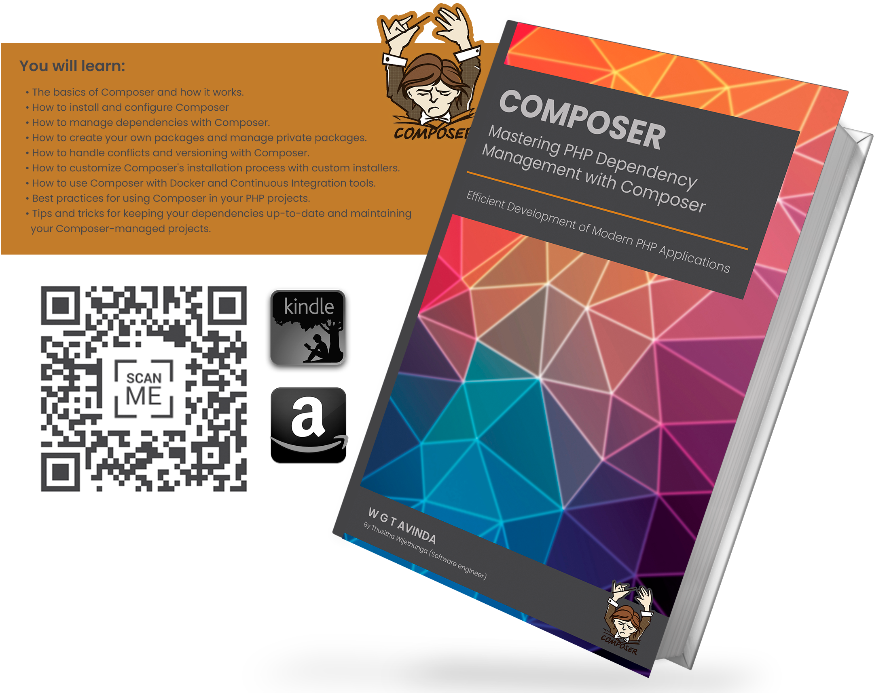

# PHP Dependency Management

Mastering PHP Dependency Management with Composer: Efficient Development of Modern PHP Applications

**Mastering PHP Dependency Management with Composer: Efficient Development of Modern PHP Applications.** As a seasoned PHP developer, I've seen firsthand how dependency management can make or break a project. That's why I wrote this book – to help fellow developers master this crucial aspect of PHP development.

What is PHP Dependency Management with Composer?: Dependency management refers to the process of managing the external libraries, frameworks, and other code dependencies that a PHP application relies on. Composer is a powerful tool that can automate this process, saving developers time and effort. Composer uses a JSON file to define a project's dependencies, and then automatically downloads and installs them, ensuring compatibility and consistency across the entire application.

The Benefits of Using Composer: Using Composer offers many benefits to PHP developers. First and foremost, it streamlines the dependency management process, freeing developers to focus on writing code instead of managing dependencies. Composer also ensures that dependencies are up to date, compatible, and easy to install. In addition, it simplifies the process of adding or removing dependencies, making it easier to experiment with new libraries or frameworks.

## Kindle eBook

- [Read On Amazon United States](https://www.amazon.com/dp/B0BXF2KZBB)
- [Read On Amazon United Kingdom](https://www.amazon.co.uk/dp/B0BXF2KZBB)
- [Read On Amazon Germany](https://www.amazon.de/dp/B0BXF2KZBB)
- [Read On Amazon France](https://www.amazon.fr/dp/B0BXF2KZBB)
- [Read On Amazon El Salvador](https://www.amazon.es/dp/B0BXF2KZBB)
- [Read On Amazon Italy](https://www.amazon.it/dp/B0BXF2KZBB)
- [Read On Amazon Netherlands](https://www.amazon.nl/dp/B0BXF2KZBB)
- [Read On Amazon Japan](https://www.amazon.co.jp/dp/B0BXF2KZBB)
- [Read On Amazon Brazil](https://www.amazon.com.br/dp/B0BXF2KZBB)
- [Read On Amazon Canada](https://www.amazon.ca/dp/B0BXF2KZBB)
- [Read On Amazon Mexico](https://www.amazon.com.mx/dp/B0BXF2KZBB)
- [Read On Amazon Australia](https://www.amazon.com.au/dp/B0BXF2KZBB)
- [Read On Amazon India](https://www.amazon.in/dp/B0BXF2KZBB)

## Paperback

- [Read On Amazon United States](https://www.amazon.com/dp/B0BW23B4F7)
- [Read On Amazon United Kingdom](https://www.amazon.co.uk/dp/B0BW23B4F7)
- [Read On Amazon Germany](https://www.amazon.de/dp/B0BW23B4F7)
- [Read On Amazon France](https://www.amazon.fr/dp/B0BW23B4F7)
- [Read On Amazon El Salvador](https://www.amazon.es/dp/B0BW23B4F7)
- [Read On Amazon Italy](https://www.amazon.it/dp/B0BW23B4F7)
- [Read On Amazon Netherlands](https://www.amazon.nl/dp/B0BW23B4F7)
- [Read On Amazon Japan](https://www.amazon.co.jp/dp/B0BW23B4F7)
- [Read On Amazon Brazil](https://www.amazon.com.br/dp/B0BW23B4F7)
- [Read On Amazon Canada](https://www.amazon.ca/dp/B0BW23B4F7)
- [Read On Amazon Mexico](https://www.amazon.com.mx/dp/B0BW23B4F7)
- [Read On Amazon Australia](https://www.amazon.com.au/dp/B0BW23B4F7)

How the Book Can Help You: **Mastering PHP Dependency Management with Composer** is the ultimate guide to using Composer in PHP development. This book is packed with practical examples, step-by-step instructions, and real-world scenarios that show you how to use Composer to manage dependencies in your own projects. Whether you're a beginner or an experienced PHP developer, this book will help you master the art of dependency management.

## GitHub

[PHP Dependency Management with Composer](https://github.com/thusithawijethunga/php-dependency-management)
